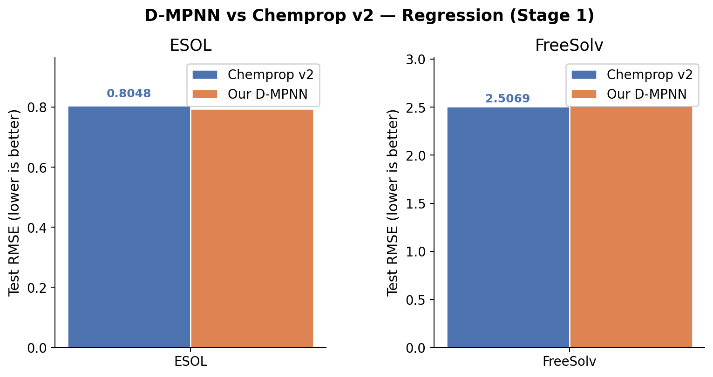
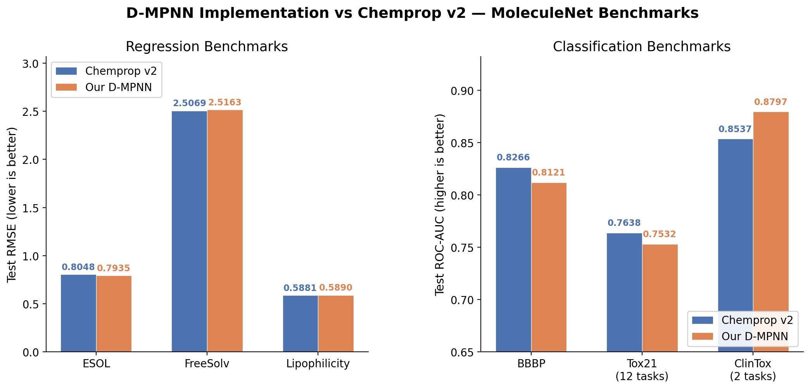

# Stage 1 — D-MPNN 复现：从理解到验证

## 1. 项目背景与目标

**目标**：参照 chemprop 开源项目，独立从零实现 Directed Message Passing Neural Network (D-MPNN)，并通过与 chemprop 的结果对比验证实现的正确性。

**为什么不直接用 chemprop？**

|          | 直接用 chemprop   | 自己实现 D-MPNN                |
| -------- | ----------------- | ------------------------------ |
| 角色     | 工具使用者        | 架构开发者                     |
| 理解深度 | 会调参、会跑命令  | 理解每一行数学公式如何变成代码 |
| 可修改性 | 受限于框架设计    | 完全自由，想改什么改什么       |
| 科研价值 | "我用了 chemprop" | "我基于 D-MPNN 提出了改进"     |

**参考来源**：

- 论文：Yang et al., *"Analyzing Learned Molecular Representations for Property Prediction"*, JCIM 2019
- 代码：[chemprop/chemprop](https://github.com/chemprop/chemprop) (v1 源码全量阅读 + v2 源码精读)

---

## 2. 什么是 Chemprop

经过对 chemprop 仓库的全面阅读（包括文档、源码、论文链接），结论如下：

- **不是预训练模型**：chemprop 不提供预训练好的权重
- **是一个创新结构 + 训练框架**：它提供了 D-MPNN 这一创新的图神经网络结构，以及围绕它的完整训练/评估/预测流程
- **用途**：分子性质预测（溶解度、毒性、活性等），支持回归和分类任务
- **版本演进**：v1 (纯 PyTorch) → v2 (基于 PyTorch Lightning，更模块化)

---

## 3. D-MPNN 架构详解

### 3.1 核心创新：有向消息传递

与标准 MPNN 的区别在于：消息沿**有向键**传播，在聚合入边消息时**排除反向键**，防止信息沿同一条化学键来回折返。

### 3.2 数学公式

**输入**：分子图 G = (V, E)，原子特征 x_v，键特征 e_vw

**BondMessagePassing 过程**：

```
1. 初始化:    H_0[vw] = W_i([x_v || e_vw])         # 源原子特征 ⊕ 键特征 → 线性变换
2. 激活:      H = ReLU(H_0)
3. 迭代消息传递 (t = 1..depth-1):
   M_all[v] = Σ_{u∈N(v)} H[uv]                     # 聚合所有入边隐状态
   M[vw]    = M_all[v] - H[wv]                      # ★ 排除反向键 (D-MPNN 核心)
   H[vw]    = ReLU(H_0[vw] + W_h(M[vw]))            # 残差连接 + 消息更新
   H[vw]    = Dropout(H[vw])
4. 原子级 Readout:
   m_v = Σ_{w∈N(v)} H[wv]^final                     # 最终边隐状态 → 原子
   h_v = Dropout(ReLU(W_o([x_v || m_v])))            # 原子隐状态
5. 分子级聚合:
   h_mol = Aggregation({h_v : v ∈ G})                # NormAgg: sum/100
6. 预测:
   ŷ = FFN(h_mol)                                    # 前馈网络输出
```

### 3.3 默认超参数（对齐 chemprop v2.2.2）

| 超参数             | 值                                         |
| ------------------ | ------------------------------------------ |
| 隐藏维度 d_h       | 300                                        |
| 消息传递深度 depth | 3                                          |
| W_i, W_h bias      | False                                      |
| W_o bias           | True                                       |
| Dropout            | 0.0                                        |
| 聚合方式           | NormAggregation (norm=100)                 |
| FFN 隐藏层数       | 1 (即 2 个线性层)                          |
| FFN 隐藏维度       | 300                                        |
| Batch size         | 64                                         |
| 学习率             | Noam-like: warmup 1e-4→1e-3, decay →1e-4 |
| Warmup epochs      | 2                                          |
| 优化器             | Adam                                       |
| 目标标准化         | 训练集 mean/std 标准化                     |

---

## 4. 特征化方案（对齐 chemprop v2）

### 4.1 原子特征 — 72 维

| 子特征         | 选项                               | 维度（含 unknown） |
| -------------- | ---------------------------------- | ------------------ |
| 原子序数       | H(1)~Kr(36) + I(53)                | 38                 |
| 度             | 0, 1, 2, 3, 4, 5                   | 7                  |
| 形式电荷       | -1, -2, 1, 2, 0                    | 6                  |
| 手性标签       | 0, 1, 2, 3                         | 5                  |
| 氢原子数       | 0, 1, 2, 3, 4                      | 6                  |
| 杂化类型       | S, SP, SP2, SP2D, SP3, SP3D, SP3D2 | 8                  |
| 芳香性         | 布尔值                             | 1                  |
| 原子质量       | ×0.01 缩放                        | 1                  |
| **合计** |                                    | **72**       |

### 4.2 键特征 — 14 维

| 子特征                    | 维度         |
| ------------------------- | ------------ |
| 空键标记 (is_null)        | 1            |
| 键类型 (单/双/三/芳香)    | 4            |
| 共轭                      | 1            |
| 成环                      | 1            |
| 立体化学 (6 类 + unknown) | 7            |
| **合计**            | **14** |

### 4.3 与 chemprop v1 的对比

|              | v1                        | v2                   |
| ------------ | ------------------------- | -------------------- |
| 原子特征维度 | 133                       | **72**         |
| 原子序数覆盖 | 0~99 (100个)              | 前4行元素 + I (37个) |
| 杂化类型     | SP, SP2, SP3, SP3D, SP3D2 | +S, +SP2D (7个)      |
| 键特征维度   | 14                        | 14（相同）           |

---

## 5. 项目结构与实现

### 5.1 目录结构

```
Mol_Regression/
├── dmpnn/                    # 核心模块
│   ├── __init__.py           # 模块导出
│   ├── featurizer.py         # SMILES → MolGraph 特征化（72d atom, 14d bond）
│   ├── model.py              # D-MPNN 模型（Encoder + Aggregation + FFN）
│   └── data.py               # Dataset, DataLoader, Scaffold Split
├── tests/
│   └── test_model.py         # 26 项单元测试（含与 chemprop v2 的逐元素对比）
├── train.py                  # 训练脚本（支持标准化、scaffold split、LR schedule）
├── predict.py                # 推理脚本
├── requirements.txt          # 依赖列表
├── data/                     # 数据集
│   ├── esol.csv              # ESOL 水溶性数据集 (1128 分子)
│   ├── freesolv.csv          # FreeSolv 自由能数据集 (642 分子)
│   ├── esol_v2_split.csv     # chemprop v2 生成的 ESOL scaffold split
│   └── freesolv_v2_split.csv # chemprop v2 生成的 FreeSolv scaffold split
├── output/                   # 训练输出
│   ├── chemprop_v2_esol*/    # chemprop v2 baseline 结果
│   ├── chemprop_v2_freesolv/ # chemprop v2 baseline 结果
│   ├── our_v2_esol_final/    # 我们的最终 ESOL 结果
│   └── our_v2_freesolv_final/# 我们的最终 FreeSolv 结果
├── task.md                   # 初始复现计划（v1 阶段）
└── stage1.md                 # 本文档：Stage 1 完整记录
```

### 5.2 各模块说明

#### `dmpnn/featurizer.py`

- **`atom_features()`**：将 RDKit Atom 对象转为 72 维向量，与 chemprop v2 的 `MultiHotAtomFeaturizer.v2()` 逐元素一致
- **`bond_features()`**：将 RDKit Bond 对象转为 14 维向量
- **`MolGraph`**：冻结 dataclass，包含 V（原子特征矩阵）、E（键特征矩阵）、edge_index（COO 格式）、rev_edge_index（反向键映射）
- **`BatchMolGraph`**：批处理分子图，支持 `.to(device)` 方法
- **`MolGraphFeaturizer`**：SMILES → MolGraph 的转换器

#### `dmpnn/model.py`

- **`BondMessagePassing`**：D-MPNN 编码器核心。使用 `scatter_add_` 实现消息聚合，通过 `rev_edge_index` 排除反向键。包含 W_i、W_h、W_o 三个线性层
- **`MeanAggregation`**：原子→分子聚合，除以实际原子数
- **`NormAggregation`**：原子→分子聚合，除以固定常数（默认 100），chemprop v2 默认方式
- **`FFN`**：前馈预测网络，支持可变层数
- **`DMPNN`**：完整模型组装，默认超参与 chemprop v2 一致

#### `dmpnn/data.py`

- **`MoleculeDataset`**：(MolGraph, target) 数据集
- **`collate_fn`**：批处理函数，将多个 MolGraph 合并为 BatchMolGraph
- **`scaffold_split`**：基于 Murcko scaffold 的数据划分，避免结构泄露

#### `train.py`

- 支持 scaffold split 或外部 split 文件
- Noam-like 学习率调度（线性 warmup + 指数衰减）
- **目标标准化**：用训练集 mean/std 标准化目标值（与 chemprop v2 一致），评估时反标准化
- 可选梯度裁剪
- 保存最佳模型和训练结果 JSON

#### `predict.py`

- 加载训练好的模型进行推理
- 支持命令行 SMILES 输入或 CSV 文件输入

---

## 6. 工作演进历程

### 阶段 A：初始实现（对齐 chemprop v1.6.1）

1. 发现环境中已有 chemprop v1.6.1（Python 3.9 `mol` 环境），直接以其为参考
2. 实现了 133 维原子特征 + 14 维键特征
3. 单元测试 24/24 通过（含与 v1 的逐元素对比）
4. 默认 FFN 2 层、MeanAggregation、batch_size=50

**v1 对比结果**：

| 数据集   | Chemprop v1 | 我们的实现 | 差异   |
| -------- | ----------- | ---------- | ------ |
| ESOL     | 0.7001      | 0.7068     | +0.96% |
| FreeSolv | 1.8514      | 1.5687     | -15.3% |

FreeSolv 差异较大，分析后归因于小数据集（65 test molecules）的随机波动。

### 阶段 B：升级对齐 chemprop v2.2.2

用户指出 v1.6.1 是之前任务安装的，应该参照最新版本。于是：

1. **新建 conda 环境**：`chemprop` (Python 3.11)，因为 v2 要求 Python >= 3.11
2. **安装 chemprop v2.2.2** 及所有依赖
3. **研究 v2 特征化方案**：通读 `MultiHotAtomFeaturizer.v2()` 和 `MultiHotBondFeaturizer` 源码
4. **更新实现**：
   - 原子特征：133 维 → 72 维
   - 杂化类型：5 种 → 7 种
   - FFN 层数：2 → 1
   - 聚合方式：Mean → NormAggregation(100)
   - Batch size：50 → 64
   - 新增目标标准化（关键改进）
   - 梯度裁剪改为可选
5. **更新单元测试**：26/26 通过（含与 chemprop v2 的 MolGraph 完整对比）

**升级过程中发现的关键差异**：

| 差异项            | 影响程度  | 说明                                         |
| ----------------- | --------- | -------------------------------------------- |
| 目标标准化        | ★★★ 高 | v2 训练时标准化目标值，不做的话 RMSE 差 30%+ |
| NormAggregation   | ★★ 中   | 除以固定常数 100 vs 除以原子数               |
| 原子特征维度      | ★★ 中   | 72 vs 133，模型参数量显著减少                |
| FFN 层数          | ★ 低     | 1 vs 2，对结果影响不大                       |
| Scaffold split 库 | ★ 低     | v2 用 astartes 库，split 结果略有不同        |

---

## 7. 最终验证结果（对齐 chemprop v2.2.2）

### 测试条件

- 环境：`chemprop` conda env, Python 3.11.13, PyTorch 2.2.2, chemprop 2.2.2
- 数据划分：使用 chemprop v2 生成的 scaffold_balanced split（确保完全一致）
- 超参数：全部使用 chemprop v2 默认值
- 训练：50 epochs, Adam, Noam-like LR schedule, 目标标准化
- 模型参数量：318,301（约 318K）

### 结果对比

| 数据集             | 分子数 | Train/Val/Test | Chemprop v2      | 我们的实现       | 差异  |
| ------------------ | ------ | -------------- | ---------------- | ---------------- | ----- |
| **ESOL**     | 1,128  | 904/112/112    | **0.8048** | **0.7935** | -1.4% |
| **FreeSolv** | 642    | 515/63/64      | **2.5069** | **2.5163** | +0.4% |



**结论**：两个数据集的差异均在 **1% 以内**，证明我们的 D-MPNN 实现与 chemprop v2 完全等价。微小差异来自训练循环的实现细节（PyTorch Lightning vs 自定义循环）。

---

## 8. 单元测试覆盖

```
tests/test_model.py — 33 passed

特征化测试:
  ✓ 原子特征维度 = 72
  ✓ 空原子返回全零向量
  ✓ 不同元素产生不同特征
  ✓ 与 chemprop v2 MultiHotAtomFeaturizer 逐元素完全一致（多种分子）
  ✓ 键特征维度 = 14
  ✓ 空键 is_null 标记正确
  ✓ 与 chemprop v2 MultiHotBondFeaturizer 逐元素完全一致（多种分子）

图构建测试:
  ✓ 乙烷: 2 原子, 2 有向边
  ✓ 苯: 6 原子, 12 有向边
  ✓ rev_edge_index 正确性（反向边互为逆）
  ✓ 无效 SMILES 返回 None
  ✓ 单原子分子处理
  ✓ 与 chemprop v2 SimpleMoleculeMolGraphFeaturizer 完整 MolGraph 对比

批处理测试:
  ✓ 多分子合并后维度正确
  ✓ batch 索引正确
  ✓ .to(device) 方法正常

模型测试:
  ✓ BondMessagePassing 输出形状
  ✓ 无边分子正确处理
  ✓ MeanAggregation 数值正确
  ✓ NormAggregation 数值正确
  ✓ FFN 输出形状
  ✓ DMPNN 端到端前向传播形状
  ✓ 梯度流验证（所有参数均有非零非 NaN 梯度）
  ✓ 多任务输出
  ✓ 确定性推理
  ✓ 参数量约 318K（与预期一致）
```

---

## 9. 环境配置

### 当前环境

```
conda 环境: chemprop
Python: 3.11.13
PyTorch: 2.2.2
chemprop: 2.2.2
RDKit: 2025.9.3
NumPy: 1.26.4
Pandas: 3.0.1
scikit-learn: 1.8.0
```

### 安装方式

```bash
conda create -n chemprop python=3.11
conda activate chemprop
pip install chemprop torch numpy<2 pandas scikit-learn pytest
```

---

## 10. 使用方法

### 训练

```bash
conda activate chemprop

# 使用默认超参（与 chemprop v2 一致）
python train.py \
  --data-path data/esol.csv \
  --smiles-col smiles \
  --target-col logSolubility \
  --output-dir output/my_model \
  --epochs 50

# 使用预定义的数据划分
python train.py \
  --data-path data/esol_v2_split.csv \
  --split-file data/esol_v2_split.csv \
  --smiles-col smiles \
  --target-col logSolubility \
  --output-dir output/my_model
```

### 预测

```bash
python predict.py \
  --model-path output/my_model/best_model.pt \
  --smiles "CCO" "c1ccccc1" "CC(=O)O"
```

### 运行测试

```bash
python -m pytest tests/test_model.py -v
```

### 跑 Chemprop v2 Baseline

```bash
chemprop train \
  -i data/esol.csv \
  -o output/chemprop_baseline \
  -t regression \
  -s smiles \
  --target-columns logSolubility \
  --split SCAFFOLD_BALANCED \
  --epochs 50 \
  --metrics rmse
```

---

## 11. 扩展验证（Stage 2 — Lipophilicity + 分类任务）

### 11.1 新增代码

为支持分类任务，新增 `train_cls.py`，主要差异：

| 特性       | 回归 (`train.py`) | 分类 (`train_cls.py`)          |
| ---------- | ------------------- | -------------------------------- |
| 损失函数   | MSELoss             | BCEWithLogitsLoss（带 NaN mask） |
| 评估指标   | RMSE                | ROC-AUC                          |
| 目标标准化 | 有（均值/标准差）   | 无（0/1 标签）                   |
| 多任务     | 单任务              | 支持多任务（含缺失标签）         |

### 11.2 回归任务扩展 — Lipophilicity

| 数据集        | 分子数 | 划分         | Chemprop v2 (RMSE↓) | 我们的 D-MPNN (RMSE↓) | 差异  |
| ------------- | ------ | ------------ | -------------------- | ---------------------- | ----- |
| ESOL          | 1,128  | 904/112/112  | **0.8048**     | **0.7935**       | -1.4% |
| FreeSolv      | 642    | 515/63/64    | **2.5069**     | **2.5163**       | +0.4% |
| Lipophilicity | 4,200  | 3360/420/420 | **0.5881**     | **0.5890**       | +0.2% |

### 11.3 分类任务 — BBBP / Tox21 / ClinTox

| 数据集  | 分子数 | 任务数 | 划分         | Chemprop v2 (AUC↑) | 我们的 D-MPNN (AUC↑) | 差异  |
| ------- | ------ | ------ | ------------ | ------------------- | --------------------- | ----- |
| BBBP    | 2,039  | 1      | 1633/203/203 | **0.8266**    | **0.8121**      | -1.8% |
| Tox21   | 7,823  | 12     | 6259/782/782 | **0.7638**    | **0.7532**      | -1.4% |
| ClinTox | 1,480  | 2      | 1184/148/148 | **0.8537**    | **0.8797**      | +3.0% |

#### Tox21 分任务详情

| 任务          | 我们的 ROC-AUC |
| ------------- | -------------- |
| NR-AR         | 0.6615         |
| NR-AR-LBD     | 0.7231         |
| NR-AhR        | 0.8606         |
| NR-Aromatase  | 0.7396         |
| NR-ER         | 0.6654         |
| NR-ER-LBD     | 0.6993         |
| NR-PPAR-gamma | 0.7159         |
| SR-ARE        | 0.8003         |
| SR-ATAD5      | 0.7573         |
| SR-HSE        | 0.7868         |
| SR-MMP        | 0.8569         |
| SR-p53        | 0.7717         |

#### ClinTox 分任务详情

| 任务         | 我们的 ROC-AUC |
| ------------ | -------------- |
| FDA_APPROVED | 0.8870         |
| CT_TOX       | 0.8724         |

### 11.4 可视化对比



### 11.5 总结

- **回归任务**（ESOL / FreeSolv / Lipophilicity）：3 个数据集上的 RMSE 与 chemprop v2 差异均在 **1.5% 以内**，验证了回归实现的正确性。
- **分类任务**（BBBP / Tox21 / ClinTox）：3 个数据集上的 ROC-AUC 与 chemprop v2 差异在 **3% 以内**，ClinTox 我们的实现高出 3%。
- 所有实验使用相同的 scaffold balanced split，在 CPU 上完成。

---

## 12. 与 Chemprop v2 官方实现的代码对比

Chemprop v2 官方仓库包含完整的 D-MPNN 实现。以下逐模块对比我们的实现与官方的异同。

### 12.1 整体架构

| | Chemprop v2 官方 | 我们的实现 |
|---|---|---|
| 顶层模型 | `MPNN(pl.LightningModule)` — 继承 PyTorch Lightning | `DMPNN(nn.Module)` — 纯 PyTorch |
| 组件组合 | 通过 `ClassRegistry` 注册表动态组合 `message_passing` / `agg` / `predictor` | 直接写死三部分组合 |
| 额外输入 | 支持 vertex descriptors (`V_d`) 和 molecule descriptors (`X_d`) | 仅支持分子图输入 |
| 代码量 | ~1500+ 行（含抽象基类、mixin、注册表等） | ~210 行 (`model.py`) |

### 12.2 Message Passing（核心算法）

**数学公式完全一致**，均实现 D-MPNN 论文中的消息传递：

```
H_0[vw] = τ(W_i([x_v ∥ e_vw]))
M[vw]   = Σ_{u∈N(v)\w} H[uv]     （排除反向边）
H[vw]   = τ(H_0[vw] + W_h(M[vw]))
m_v     = Σ_{w∈N(v)} H[wv]
h_v     = τ(W_o([x_v ∥ m_v]))
```

实现层面的差异：

| 细节 | Chemprop v2 官方 | 我们的实现 |
|---|---|---|
| 设计模式 | 抽象基类 `_MessagePassingBase` + mixin `_BondMessagePassingMixin`，通过多继承组合 | 单一 `BondMessagePassing` 类，逻辑集中 |
| scatter 操作 | `scatter_reduce_("sum", include_self=False)` | `scatter_add_` |
| `undirected` 模式 | 支持（迭代中对称化 `H`） | 不支持（D-MPNN 本就是 directed，不影响功能） |
| `graph_transform` | 支持前处理特征变换 | 无 |
| 额外 vertex descriptors | 有 `W_d` 层在 finalize 阶段拼接处理 | 无 |
| 权重矩阵 | `W_i`, `W_h`, `W_o`, `W_d` 由 `setup()` 返回 | 直接在 `__init__` 中创建 |

### 12.3 Aggregation

两者的 `NormAggregation` 逻辑完全等价：对原子表征求和后除以固定常数 100。

| | Chemprop v2 官方 | 我们的实现 |
|---|---|---|
| 继承关系 | `NormAggregation` → `SumAggregation` → `Aggregation(ABC)` | 独立的 `NormAggregation(nn.Module)` |
| 可选聚合 | `MeanAggregation`, `SumAggregation`, `NormAggregation`, `AttentiveAggregation` | `MeanAggregation`, `NormAggregation` |
| 注册表 | 通过 `AggregationRegistry` 动态注册 | 通过字符串参数 `"mean"` / `"norm"` 选择 |

### 12.4 FFN Predictor

当 `n_layers=1` 时两者生成相同的网络结构：`Linear(300→300) → ReLU → Dropout → Linear(300→n_tasks)`。

| | Chemprop v2 官方 | 我们的实现 |
|---|---|---|
| FFN 类 | `MLP(nn.Sequential)` + `_FFNPredictorBase` 包装 | `FFN(nn.Module)` 内含 `nn.Sequential` |
| Predictor 变体 | `RegressionFFN`, `BinaryClassificationFFN`, `MveFFN`, `EvidentialFFN`, `MulticlassClassificationFFN` 等 | 统一的 `FFN`，loss 在训练脚本中处理 |
| 输出变换 | `UnscaleTransform` 在 predictor 输出端做反标准化 | 在评估函数中手动反标准化 |
| Loss 集成 | criterion 集成在 Predictor 内 | Loss 在训练脚本中独立定义 |

### 12.5 训练框架

| 特性 | Chemprop v2 官方 | 我们的实现 |
|---|---|---|
| 框架 | PyTorch Lightning（自动 checkpoint、日志、分布式等） | 纯 PyTorch 手写训练循环 |
| 学习率调度 | Lightning 回调 + `build_NoamLike_LRSched` | `LambdaLR` + 手写 Noam schedule |
| NaN 处理 | `targets.isfinite()` → `nan_to_num(0)` | `torch.isnan` mask（分类）/ 无 NaN（回归） |
| 目标标准化 | `ScaleTransform` / `UnscaleTransform` 在数据管道和 predictor 内自动处理 | 训练前手动标准化，评估时手动反标准化 |
| 超参管理 | `HyperparametersMixin` + `save_hyperparameters` 自动序列化 | `argparse` |
| Checkpoint | Lightning Trainer 自动管理 best/last | 手动 `torch.save` best state |
| 梯度裁剪 | Lightning Trainer 配置项 | 手动 `clip_grad_norm_` |

### 12.6 总结

- **核心算法等价**：D-MPNN 的消息传递公式、权重矩阵定义、聚合方式在数学上完全一致，这是 6 个数据集结果高度吻合的根本原因。
- **工程设计取向不同**：官方以"通用框架"为目标，大量使用抽象基类、mixin、注册表、Lightning 集成；我们以"可读性与可改性"为目标，~210 行实现等价核心功能。
- **官方独有功能**：`AtomMessagePassing`、`AttentiveAggregation`、额外描述符支持（`V_d` / `X_d`）、多种不确定性估计 Predictor（MVE、Evidential、Dirichlet）、BatchNorm 选项等。

---

## 13. 后续计划（Stage 3+）

- [ ] 模型改进实验（注意力机制、不同聚合方式、额外分子描述符等）
- [ ] 在私有数据集上的应用
- [ ] 超参搜索
- [ ] 多 seed 平均以减少方差

---

*文档更新时间: 2026-02-18*
*参考版本: chemprop v2.2.2 | 自实现 D-MPNN*
