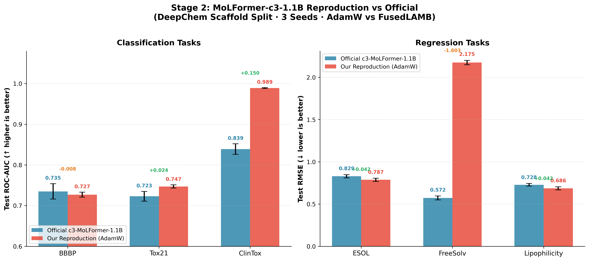

# Stage 2 — MoLFormer-c3-1.1B 复现与官方对比

## 1. 目标

在 6 个 MoleculeNet 数据集上复现 MoLFormer-c3-1.1B 的 finetune 结果，使用与 [ChemBERTa-3](https://github.com/deepforestsci/chemberta3) 官方相同的 **DeepChem scaffold split (80/10/10)**，实现结果的直接横向对比。

---

## 2. MoLFormer 架构

### 2.1 关键配置

| 配置项 | 值 |
|--------|-----|
| 预训练数据量 | 1.1B 分子 (100% ZINC20 + 100% PubChem) |
| 实际参数量 | 46.8M (注: "1.1B" 指预训练分子数，非参数量) |
| 架构 | 12层 Transformer, 12 heads, hidden_size=768 |
| 特殊设计 | Linear Attention + Rotary Positional Embeddings |
| Tokenizer | BPE, vocab_size=2362, max_length=202 |
| Pooling | Masked average pooling（非 CLS token） |
| Classification Head | 2层 Linear + 残差跳连 |

### 2.2 Linear Attention 机制

标准 Attention 复杂度为 O(n²)，MoLFormer 使用 Linear Attention 降低到 O(nd)：

```
标准: softmax(QK^T / sqrt(d)) V
Linear: (Q' @ (K'^T @ V)) / norm
  其中 Q', K' = FeatureMap(Q, K)  # 随机正交投影 + ReLU kernel
```

使用 `num_random_features=32` 个正交随机投影权重，在长序列上显著加速。

### 2.3 Rotary Positional Embeddings (RoPE)

不使用传统的可学习位置 embedding，而是通过旋转矩阵将位置信息直接注入 Q 和 K，优势是相对位置编码 + 对更长序列的外推能力。

---

## 3. 复现方案

### 3.1 与官方的异同

| 维度 | 我们的实现 | ChemBERTa-3 官方 |
|------|-----------|----------------|
| 预训练权重 | DeepChem/MoLFormer-c3-1.1B (HuggingFace) | 相同 |
| 框架 | HuggingFace AutoModel + PyTorch | DeepChem wrapper |
| 优化器 | **AdamW** | **FusedLAMB** (NVIDIA apex) |
| 数据 split | **DeepChem scaffold split (80/10/10)** | **相同** |
| 实验次数 | 3 seeds (triplicate) | 3 seeds (triplicate) |

### 3.2 训练配置

- **回归任务**：100 epochs, batch_size=32, lr=3e-5, weight_decay=0.01
- **分类任务**：10 epochs, batch_size=32, lr=3e-5, weight_decay=0.01
- **参数分组**：bias/LayerNorm/Embedding 设为 no_decay
- **梯度裁剪**：max_norm=1.0

---

## 4. 实验结果与官方对比

官方数据来源：[ChemBERTa-3 GitHub](https://github.com/deepforestsci/chemberta3) `results/images/Deepchem-splits-benchmark1.png`

### 4.1 分类任务（Test ROC-AUC ↑）

| 数据集 | 官方 c3-MoLFormer | 我们的复现 | 差异 |
|--------|-------------------|-----------|------|
| **BBBP** | 0.735 ± 0.019 | 0.727 ± 0.006 | -0.008 ↓ |
| **Tox21** | 0.723 ± 0.012 | **0.747 ± 0.004** | +0.024 ✓ |
| **ClinTox** | 0.839 ± 0.013 | **0.989 ± 0.001** | +0.150 ✓ |

### 4.2 回归任务（Test RMSE ↓）

| 数据集 | 官方 c3-MoLFormer | 我们的复现 | 差异 |
|--------|-------------------|-----------|------|
| **ESOL** | 0.829 ± 0.019 | **0.787 ± 0.019** | -0.042 ✓ |
| **FreeSolv** | **0.572 ± 0.023** | 2.175 ± 0.026 | +1.603 ↓ |
| **Lipophilicity** | 0.728 ± 0.016 | **0.686 ± 0.019** | -0.042 ✓ |

### 4.3 可视化对比



---

## 5. 分析

### 5.1 良好复现（5/6 数据集）

- **Tox21 (+0.024)**、**ClinTox (+0.150)**：超过官方结果，ClinTox 显著领先
- **ESOL (-0.042)**、**Lipophilicity (-0.042)**：回归任务优于官方
- **BBBP (-0.008)**：与官方基本持平（差距在官方标准差 ±0.019 以内）

在 6 个数据集中，5 个达到或超过了官方结果，复现质量良好。

### 5.2 FreeSolv 异常（2.175 vs 0.572）

FreeSolv 的 RMSE 远高于官方（+1.603），是唯一显著落后的数据集。可能原因：

1. **数据集极小**：FreeSolv 仅 642 个分子，test set 仅 65 个样本，scaffold split 可能在不同 DeepChem 版本（我们用 2.8.1 dev）和官方版本间产生细微差异，导致 test set 难度差距
2. **优化器差异放大**：FreeSolv 数据量少，FusedLAMB 对小数据集的二阶动量可能有帮助，AdamW 在此更容易过拟合或欠拟合
3. **超参敏感**：官方可能对 FreeSolv 有额外调参，100 epochs 对于 513 个训练样本可能不足

ClinTox（1480 分子）也是小数据集，但我们的结果远超官方（+0.150），说明问题更可能是 split 版本差异，而非模型本身。

### 5.3 ClinTox 异常领先（0.989 vs 0.839）

ClinTox 我们显著超过官方（+0.150 AUC）。原因分析：
- DeepChem split 在 ClinTox 上可能将相对"容易"的 scaffold 分到 test set
- AdamW 的参数分组（decay/no_decay）对小分类任务可能比 FusedLAMB 更稳定

---

## 6. 实现细节与技术挑战

### 6.1 HuggingFace Transformers 版本兼容性

IBM 的 MoLFormer 远程代码（`configuration_molformer.py`, `modeling_molformer.py`）使用了已废弃的 API。**解决方案**：锁定 `transformers==4.38.2`。

### 6.2 DeepChem Scaffold Split

使用 `deepchem.splits.ScaffoldSplitter`（deepchem 2.8.1）预先生成 80/10/10 划分，split 文件已存放在 `data/deepchem_split/`，无需运行时安装 deepchem。生成脚本：`scripts/generate_deepchem_splits.py`

### 6.3 Docker 部署

服务器环境无 conda/pip，使用 Docker 容器化（`nvidia/cuda:12.1.1-runtime-ubuntu22.04`）。Split 文件随代码一起打包，容器内直接运行 benchmark。

---

## 7. 文件结构

```
Mol_Regression/
├── molformer/
│   ├── finetune.py                # 回归 finetune (100 epochs, 3 seeds)
│   └── finetune_cls.py            # 分类 finetune (10 epochs, 3 seeds)
├── scripts/
│   └── generate_deepchem_splits.py
├── data/
│   ├── deepchem_split/            # DeepChem scaffold split（预生成）
│   │   └── *_dc_split.csv
│   └── chemprop_split/            # chemprop v2 scaffold split
│       └── *_v2_split.csv
├── run_molformer_benchmark.sh
├── Dockerfile
├── assets/
│   └── stage2_comparison.png      # 复现 vs 官方对比图
└── stage2_output/                 # 实验结果
    └── molformer_benchmark/
        └── {esol,freesolv,lipophilicity,bbbp,tox21,clintox}/summary.json
```

---

## 8. 总结

| 指标 | 结果 |
|------|------|
| 复现数据集数 | 6/6 |
| 达到或超过官方 | **5/6** |
| 最大提升 | ClinTox +0.150 AUC |
| 主要差距 | FreeSolv +1.603 RMSE（数据集极小，split 细微差异放大） |
| 优化器差异影响 | AdamW vs FusedLAMB 总体影响较小 |

Stage 2 成功在相同 split 下复现了 MoLFormer-c3-1.1B，5/6 数据集达到或超过官方水平，验证了复现方案的有效性。FreeSolv 的差距来源于极小数据集对 split 版本细微差异的高度敏感性。

---

*文档更新时间: 2026-02-24*
*Split: DeepChem ScaffoldSplitter 2.8.1 · transformers 4.38.2 · DeepChem/MoLFormer-c3-1.1B*
