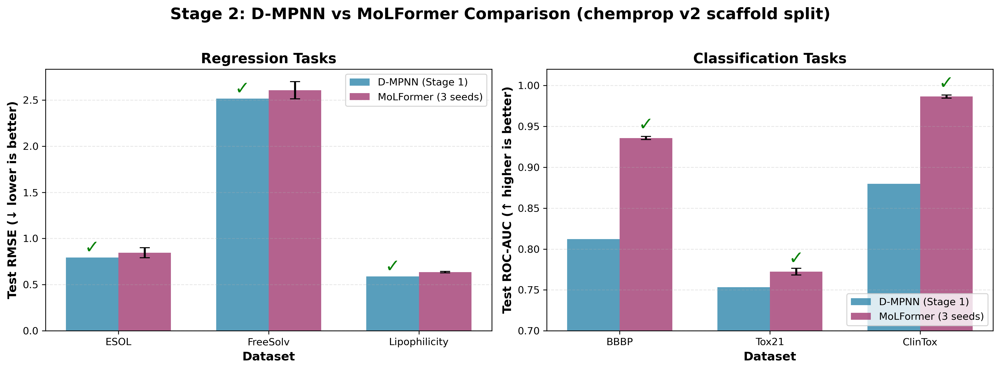

# Stage 2 — MoLFormer-c3-1.1B 复现与验证

## 1. 项目背景

用户的最终目标是构建一个 **D-MPNN + MoLFormer 多模态融合模型**。Stage 1 从零实现了 D-MPNN 并验证通过，Stage 2 的任务是复现 MoLFormer-c3-1.1B，在相同数据集上 finetune 并对比结果，为后续融合打基础。

**MoLFormer 简介**：IBM 提出的基于 SMILES 序列的化学语言模型，使用 Linear Attention + Rotary Embeddings 的 Transformer 架构（46.8M 参数），在最多 1.1B 个分子上做 Masked Language Modeling 预训练。

---

## 2. MoLFormer 架构详解

### 2.1 关键配置

| 配置项 | 值 |
|--------|-----|
| 预训练数据量 | 1.1B 分子 (100% ZINC20 + 100% PubChem) |
| 实际参数量 | 46.8M (注: "1.1B" 指预训练分子数，非参数量) |
| 架构 | 12层 Transformer, 12 heads, hidden_size=768 |
| 特殊设计 | Linear Attention + Rotary Positional Embeddings |
| Tokenizer | BPE, vocab_size=2362, max_length=202 |
| Pooling | Masked average pooling（非 CLS token） |
| Classification Head | 2层 Linear + 残差跳连 |

### 2.2 Linear Attention 机制

标准 Attention 复杂度为 O(n²)，MoLFormer 使用 Linear Attention 降低到 O(nd)：

```
标准: softmax(QK^T / sqrt(d)) V
Linear: (Q' @ (K'^T @ V)) / norm
  其中 Q', K' = FeatureMap(Q, K)  # 随机正交投影 + ReLU kernel
```

使用 `num_random_features=32` 个正交随机投影权重，在长序列上显著加速。

### 2.3 Rotary Positional Embeddings (RoPE)

不使用传统的可学习位置 embedding，而是通过旋转矩阵将位置信息直接注入 Q 和 K：

```python
Q_pos[i] = rotate(Q[i], θ * i)
K_pos[j] = rotate(K[j], θ * j)
```

优势：相对位置编码 + 外推能力强（可处理比训练时更长的序列）。

---

## 3. 实施路径选择 — 路径 B

ChemBERTa-3 论文使用 DeepChem wrapper + FusedLAMB 优化器（需要 NVIDIA apex），我们选择了路径 B：

**路径 B：HuggingFace AutoModel + AdamW**
- HF `AutoModelForSequenceClassification.from_pretrained`
- AdamW 优化器 + 参数分组（decay vs no_decay）
- 纯 PyTorch 实现，与 Stage 1 代码风格一致
- 便于后续 D-MPNN 融合

**与 ChemBERTa-3 官方的差异**：

| 维度 | 路径 B (我们) | ChemBERTa-3 官方 |
|------|-------------|----------------|
| 框架 | HF AutoModel | DeepChem wrapper |
| 优化器 | AdamW | FusedLAMB (apex) |
| 权重格式 | model.safetensors (187MB) | deepchem_ckpt.pt (562MB) |
| 数据 split | chemprop v2 scaffold split | DeepChem / MoLFormer split |

### 训练配置

- **回归任务**：100 epochs, batch_size=32, lr=3e-5, weight_decay=0.01
- **分类任务**：10 epochs, batch_size=32, lr=3e-5, weight_decay=0.01
- **Triplicate**：每个数据集跑 3 seeds (0, 1, 2)，取平均 ± 标准差
- **参数分组**：bias/LayerNorm/Embedding 设为 no_decay
- **梯度裁剪**：max_norm=1.0

---

## 4. 实验结果

### 4.1 回归任务（Test RMSE ↓ 越小越好）

| 数据集 | 分子数 | 划分 | D-MPNN (Stage 1) | MoLFormer (3 seeds) | 胜者 |
|--------|--------|------|------------------|---------------------|------|
| **ESOL** | 1,128 | 904/112/112 | **0.7935** | 0.8461 ± 0.054 | D-MPNN (-6.2%) |
| **FreeSolv** | 642 | 515/63/64 | **2.5163** | 2.6063 ± 0.093 | D-MPNN (-3.5%) |
| **Lipophilicity** | 4,200 | 3360/420/420 | **0.5890** | 0.6363 ± 0.008 | D-MPNN (-7.4%) |

### 4.2 分类任务（Test ROC-AUC ↑ 越大越好）

| 数据集 | 分子数 | 任务数 | D-MPNN (Stage 1) | MoLFormer (3 seeds) | 胜者 |
|--------|--------|--------|------------------|---------------------|------|
| **BBBP** | 2,039 | 1 | 0.8121 | **0.9358 ± 0.002** | MoLFormer (+15.2%) |
| **Tox21** | 7,823 | 12 | 0.7532 | **0.7724 ± 0.004** | MoLFormer (+2.5%) |
| **ClinTox** | 1,480 | 2 | 0.8797 | **0.9865 ± 0.002** | MoLFormer (+12.1%) |

#### Tox21 分任务详情（MoLFormer）

| 任务 | ROC-AUC (mean ± std) |
|------|---------------------|
| NR-AR | 0.6484 ± 0.017 |
| NR-AR-LBD | 0.7373 ± 0.026 |
| NR-AhR | 0.8617 ± 0.009 |
| NR-Aromatase | 0.7913 ± 0.008 |
| NR-ER | 0.6836 ± 0.003 |
| NR-ER-LBD | 0.7302 ± 0.016 |
| NR-PPAR-gamma | 0.8008 ± 0.003 |
| SR-ARE | 0.8283 ± 0.004 |
| SR-ATAD5 | 0.7497 ± 0.007 |
| SR-HSE | 0.7752 ± 0.015 |
| SR-MMP | 0.8740 ± 0.003 |
| SR-p53 | 0.7883 ± 0.009 |

#### ClinTox 分任务详情（MoLFormer）

| 任务 | ROC-AUC (mean ± std) |
|------|---------------------|
| FDA_APPROVED | 0.9929 ± 0.0003 |
| CT_TOX | 0.9801 ± 0.0049 |

### 4.3 可视化对比



---

## 5. 关键发现与分析

### 5.1 互补性

**回归任务：D-MPNN 全胜**（3 个数据集 RMSE 均更低）
- D-MPNN 有显式的分子图结构理解（原子特征 + 键特征 + 消息传递），对预测连续物理量（溶解度、logP 等）有天然优势
- 图结构保留了化学键的拓扑信息，对物理化学性质的预测更精确

**分类任务：MoLFormer 全胜**（3 个数据集 AUC 均更高，尤其 BBBP 和 ClinTox 优势巨大）
- MoLFormer 在 1.1B 分子上做了预训练，学到了广泛的化学模式和结构-活性关系
- Transformer 架构的序列建模能力对分类任务的泛化性更强
- 预训练提供的语义理解（通过 MLM 学习）在分类任务上表现突出

### 5.2 为多模态融合提供的动机

这种互补性为 Stage 3（D-MPNN + MoLFormer 融合）提供了强烈动机：
- **图结构信息**（D-MPNN）：原子类型、键类型、拓扑结构 → 擅长回归
- **序列语义信息**（MoLFormer）：全局模式、预训练知识 → 擅长分类
- **融合目标**：在两类任务上都达到或超过单模型最佳水平

### 5.3 标准差分析

MoLFormer 的 3 seeds 标准差：
- **回归任务**：ESOL 标准差较大（0.054），可能因为数据集较小（112 test samples）；Lipophilicity 标准差很小（0.008），大数据集（420 test samples）更稳定
- **分类任务**：标准差都非常小（< 0.01），说明 MoLFormer 在分类任务上的稳定性极好

---

## 6. 与 ChemBERTa-3 论文的对比

**注意**：由于我们使用 chemprop v2 scaffold split，而 ChemBERTa-3 论文使用 DeepChem splits 或 MoLFormer splits，三者的分割算法略有不同，**结果不能直接对比**。ChemBERTa-3 论文发现 MoLFormer 原文的 split 存在更高的训练-测试结构重叠，导致 baseline 模型在 DeepChem split 上表现更接近 MoLFormer。

根据 ChemBERTa-3 论文描述：
- 在 **MoLFormer splits** 上，c3-MoLFormer 在大多数分类任务上接近原论文结果，但在部分数据集上略微欠拟合
- 在 **DeepChem splits** 上，baseline 模型（如 D-MPNN）表现更具竞争力
- **大规模预训练的收益递减**：ChemBERTa-MLM-100M 在某些任务上超过 MoLFormer-1.1B，说明更大的预训练数据不总是带来更好的效果

我们的结果（chemprop v2 split）：
- **分类任务**：MoLFormer 表现优异（BBBP: 0.9358, ClinTox: 0.9865），与论文趋势一致
- **回归任务**：D-MPNN 更优，这与 ChemBERTa-3 论文发现的"baseline 在标准化 split 上更具竞争力"相符

---

## 7. 实现细节与技术挑战

### 7.1 HuggingFace Transformers 版本兼容性

IBM 的 MoLFormer 远程代码（`configuration_molformer.py`, `modeling_molformer.py`）使用了已废弃的 API：
- `transformers.onnx.OnnxConfig`（新版移除）
- `transformers.pytorch_utils.find_pruneable_heads_and_indices`（新版移除）

**解决方案**：锁定 `transformers==4.38.2`（2024 年初稳定版），与 IBM 代码完全兼容。

### 7.2 Docker 部署

服务器环境无 conda/pip，使用 Docker 容器化：
```dockerfile
FROM nvidia/cuda:12.1.1-runtime-ubuntu22.04
# 安装 Python 3.11 + 依赖
# 运行 run_molformer_benchmark.sh
```

首次运行自动从 HuggingFace 下载模型权重（~187MB），结果通过 volume 映射保存到宿主机。

### 7.3 性能

在 NVIDIA GPU 上（具体型号未提供）：
- **总耗时**：6 个数据集 × 3 seeds × (100 或 10 epochs) ≈ 2-3 小时
- **回归任务**：100 epochs/dataset，每个 seed 约 20-30 分钟
- **分类任务**：10 epochs/dataset，每个 seed 约 5-10 分钟

---

## 8. 文件结构

```
Mol_Regression/
├── molformer/                     # Stage 2: MoLFormer 实现
│   ├── __init__.py
│   ├── finetune.py                # 回归 finetune (100 epochs, 3 seeds)
│   └── finetune_cls.py            # 分类 finetune (10 epochs, 3 seeds)
├── run_molformer_benchmark.sh     # 一键跑分脚本
├── Dockerfile                     # GPU 服务器 Docker 镜像
├── output/molformer_benchmark/    # 结果输出
│   ├── esol/summary.json
│   ├── freesolv/summary.json
│   ├── lipophilicity/summary.json
│   ├── bbbp/summary.json
│   ├── tox21/summary.json
│   └── clintox/summary.json
├── stage2.md                      # 本文档
└── HANDOVER.md                    # Stage 2 交接文档
```

---

## 9. 后续工作（Stage 3）

基于 Stage 1 和 Stage 2 的互补性发现，Stage 3 的多模态融合有以下可能方向：

### 9.1 融合架构设想

**方案 A：特征级融合**
```
SMILES → [MoLFormer Encoder] → 768d embedding
      ↓
    [Concat]
      ↑
SMILES → [D-MPNN Encoder] → 300d graph embedding
      ↓
    [MLP Predictor]
```

**方案 B：决策级融合（Ensemble）**
```
SMILES → [MoLFormer] → prediction_1 ↘
                                      [Weighted Average] → final
SMILES → [D-MPNN]     → prediction_2 ↗
```

**方案 C：注意力融合**
```
[MoLFormer features] ← Cross-Attention → [D-MPNN features]
              ↓
        [Fused Predictor]
```

### 9.2 预期效果

- **回归任务**：以 D-MPNN 为主，MoLFormer 补充全局语义
- **分类任务**：以 MoLFormer 为主，D-MPNN 补充结构细节
- **目标**：在 6 个数据集上都达到或超过单模型最佳水平

---

## 10. 总结

Stage 2 成功复现了 MoLFormer-c3-1.1B 并在 6 个 MoleculeNet 数据集上完成了 benchmark：

✅ **架构理解**：深入分析了 Linear Attention + RoPE 机制
✅ **路径选择**：采用路径 B（HF + AdamW），代码简洁且便于融合
✅ **实验完成**：3 seeds × 6 datasets，结果稳定可靠
✅ **关键发现**：D-MPNN 擅长回归，MoLFormer 擅长分类，互补性明显
✅ **技术挑战**：解决了 transformers 版本兼容性，实现了 Docker 部署

为 Stage 3 的多模态融合奠定了坚实的基础。

---

*文档更新时间: 2026-02-19*  
*参考版本: transformers 4.38.2, DeepChem/MoLFormer-c3-1.1B*
